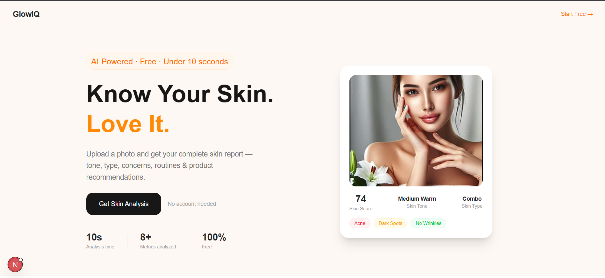
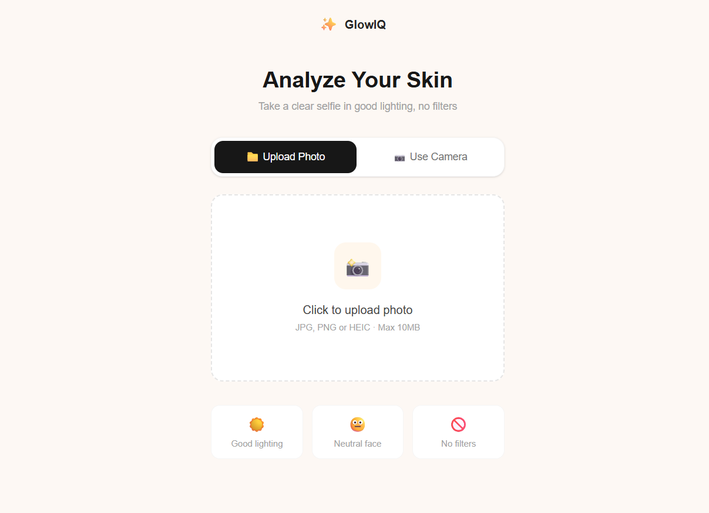
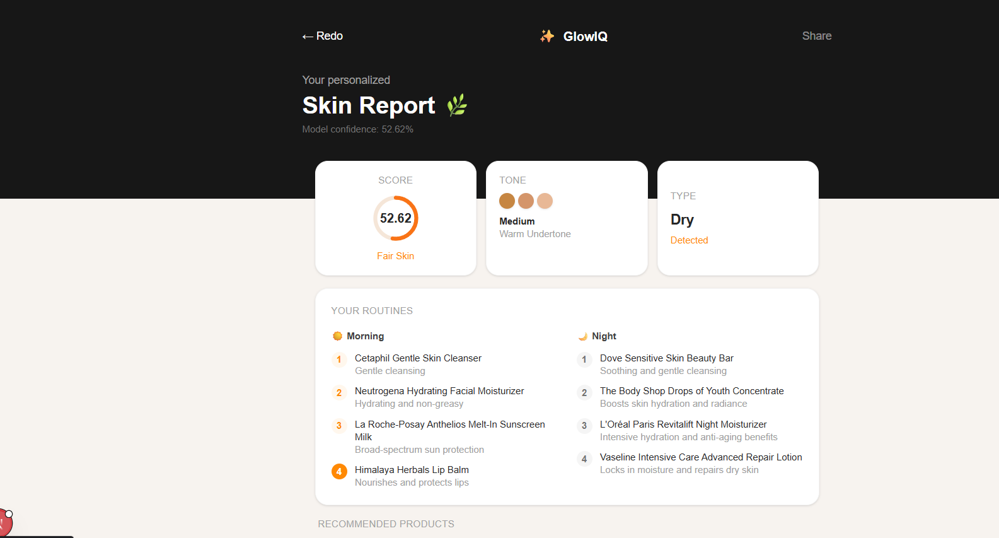

# GlowIQ — AI-Powered Skin Analysis App

**GlowIQ** is a full-stack AI web application that analyzes your skin type from a photo and generates a personalized skincare routine, product recommendations, and skin insights — powered by a custom TensorFlow model. Groq LLM is used to generate the paragraphs and points for the skin-care. So overall it is a better project for ML + GEN-AI

---

## Features

-  **Upload or capture** a face photo for skin analysis
-  **TensorFlow model** classifies skin as `Dry`, `Normal`, or `Oily`
-  **Groq LLM** (LLaMA 3.3 70B) generates:
  - Personalized morning & night skincare routine
  - Top 3 recommended products with pros/cons and Indian pricing
  - Skin tone detection
-   **Fast & free** — no paid APIs required
-  Clean, mobile-friendly UI built with **Next.js + Tailwind CSS**

---

## 🛠️ Tech Stack

| Layer | Technology |
|-------|-----------|
| Frontend | Next.js 14, Tailwind CSS |
| Backend | FastAPI (Python) |
| ML Model | TensorFlow / Keras (`.h5`) |
| LLM | Groq Model — `llama-3.3-70b-versatile` |
| LLM Framework | LangChain Core + LangChain Groq |

---

## Screenshots

### Home Page


### Analyze Page


### Results Page


## 📁 Project Structure

```
app/
├── frontend/               
│   ├── app/
│   │   ├── page.jsx           # Home page
│   │   ├── analyse/
│   │   │   └── page.jsx       
│   │   └── results/
│   │       └── page.jsx       
│   └── public/
├── backend/
│   ├── main.py               
│   ├── skin_classifier_model.h5
│   └── .env                   # GROQ_API_KEY goes here
├── screenshots/              
│   ├── home.png
│   ├── analyze.png
│   └── results.png
└── README.md
```

---

## ⚙️ Setup & Installation

### 1. Clone the repository

```bash
git clone https://github.com/yourusername/glowiq.git
cd app
```

### 2. Backend Setup

```bash
cd backend
pip install fastapi uvicorn tensorflow pillow numpy langchain-groq langchain-core python-dotenv
```

Create a `.env` file inside `/backend`:

```env
GROQ_API_KEY=your_groq_api_key_here
```

> Get your free API key at [console.groq.com](https://console.groq.com)

Run the backend:

```bash
uvicorn main:app --reload
```

Backend runs at `http://localhost:8000`

### 3. Frontend Setup

```bash
cd frontend
npm install
npm run dev
```

Frontend runs at `http://localhost:3000`

---

## 🔗 API Endpoints

| Method | Endpoint | Description |
|--------|----------|-------------|
| `GET` | `/` | Health check |
| `POST` | `/analyze` | Upload image → returns skin analysis JSON |

### Sample Response `/analyze`

```json
{
  "success": true,
  "skin_type": "Oily",
  "skin_score": 91.23,
  "skin_tone": "Medium / Warm",
  "morning_routine": [
    { "step": 1, "name": "Foaming Cleanser", "note": "Remove overnight oil" }
  ],
  "night_routine": [
    { "step": 1, "name": "Micellar Water", "note": "Remove SPF & makeup" }
  ],
  "products": [
    {
      "icon": "🧴",
      "name": "CeraVe Foaming Cleanser",
      "category": "Cleanser · Step 1",
      "price": "₹799",
      "pros": ["Removes excess oil", "Fragrance-free"],
      "cons": ["May over-strip dry areas"]
    }
  ]
}
```

---

## ML Model Info

- **Architecture:** MobileNetV2 / Custom CNN (224×224 input)
- **Classes:** `dry`, `normal`, `oily`
- **Training data:** Custom skin dataset
- **Output:** Softmax confidence scores per class

---

## Future Roadmap  

- [ ] Acne & dark spot detection (second model)
- [ ] Concerns section in results
- [ ] Shade match feature
- [ ] User history & progress tracking
- [ ] Mobile app (React Native)


##  Contributing

Pull requests are welcome! For major changes, open an issue first. You can also add a acne detaction in it.

---

<p align="center">MIT License © 2026 GlowIQ</p>